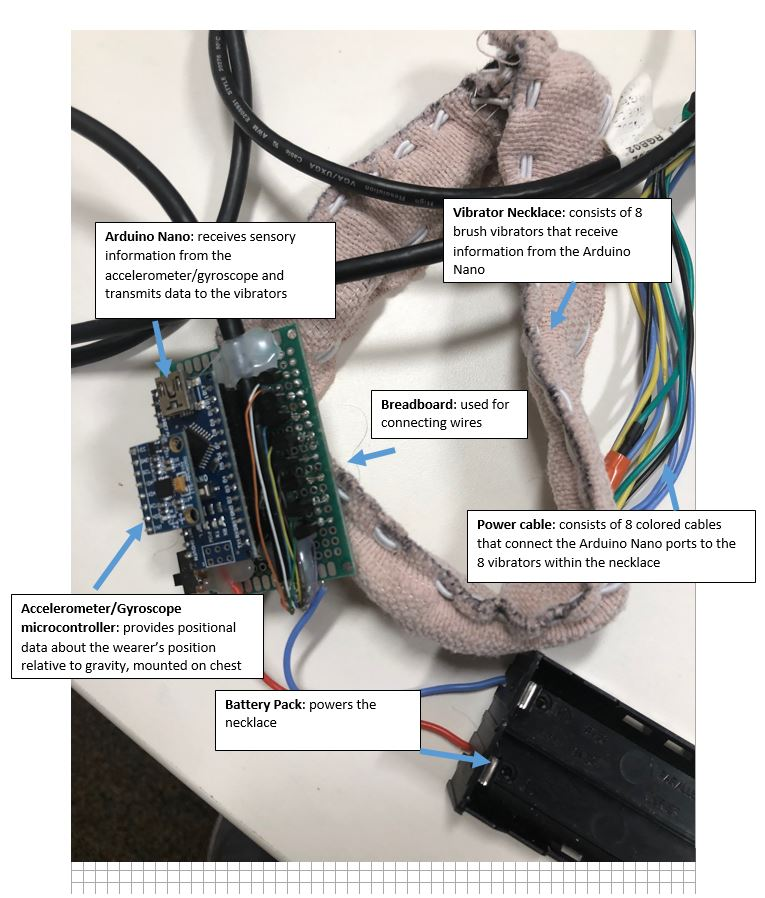

# Tactile Necklace Project

### Project Summary

Our tactile necklace was created with the goal of allowing a spatially disoriented wearer to be able to better understand his/her position relative to gravity. The necklace operates using an accelerometer and gyroscope Arduino microcontroller which transmits data to an Arduino Nano. The Nano then interprets the accelerometer/ gyroscope data and converts it into an output in the form of vibrations in the necklace. The necklace consists of eight brush motor vibrators that pulsate independently based on the position of the sensor. 

##### Contact

If you are interested in the project, email us at:

ajk6rzh@Virginia.edu

jlam7@g.ucla.edu